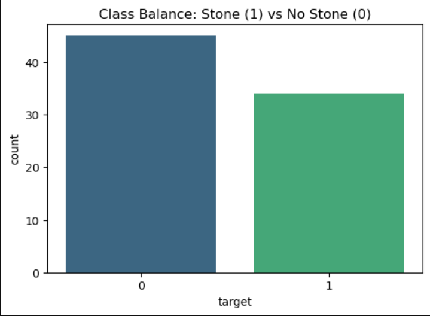

# 🩺 Kidney Stone Risk Predictor 

## 📌 Project Overview
This project applies Machine Learning to medical tabular data to predict the likelihood of kidney stone formation based on urine analysis. The goal is to provide a fast, interpretable, and accurate risk assessment tool.

## 📊 Exploratory Data Analysis (EDA)
Before modeling, the dataset was analyzed to understand the underlying biological distributions and relationships.

**1. Class Balance**
The dataset is well-balanced, meaning synthetic oversampling (like SMOTE) was not required.

**2. Feature Correlation**
The correlation heatmap revealed high multicollinearity (0.86) between `Specific Gravity` and `Osmolarity`. It also highlighted `Calcium` as the strongest individual predictor (0.54 correlation with the target).

## 🧠 Machine Learning Models
Several models were trained and evaluated to find the best fit for this non-linear medical dataset:
* **Logistic Regression:** 69% Accuracy
* **Decision Tree:** 75% Accuracy
* **Support Vector Machine (RBF):** 81% Accuracy
* **Random Forest:** 81% Accuracy 🏆 (Chosen for final deployment)

Random Forest was selected as the final model because it matches the highest accuracy while providing crucial medical interpretability.

## 🔍 Model Interpretability (Why it works)
In medical AI, explainability is as important as accuracy. The Random Forest model's feature importance extraction perfectly aligns with biological facts: **Calcium concentration** is the overwhelming primary driver of kidney stone risk.

## 🚀 Live Web Application
The model is deployed as an interactive web application using Streamlit. Users can input real-time urine metrics to calculate the precise probability of stone formation.

**Try the live app here:** https://kidney-stone-predictor-sx7g2dqe9ff2anqzzndgw7.streamlit.app/

## 💻 Tech Stack
* **Language:** Python
* **Data Manipulation & Analysis:** Pandas, NumPy
* **Data Visualization:** Seaborn, Matplotlib
* **Machine Learning:** Scikit-Learn (Random Forest Classifier)
* **Deployment:** Streamlit, Joblib

---
*Developed by Adarsh Kaushik | B.Tech CSE (AI/ML) | KIIT University*
